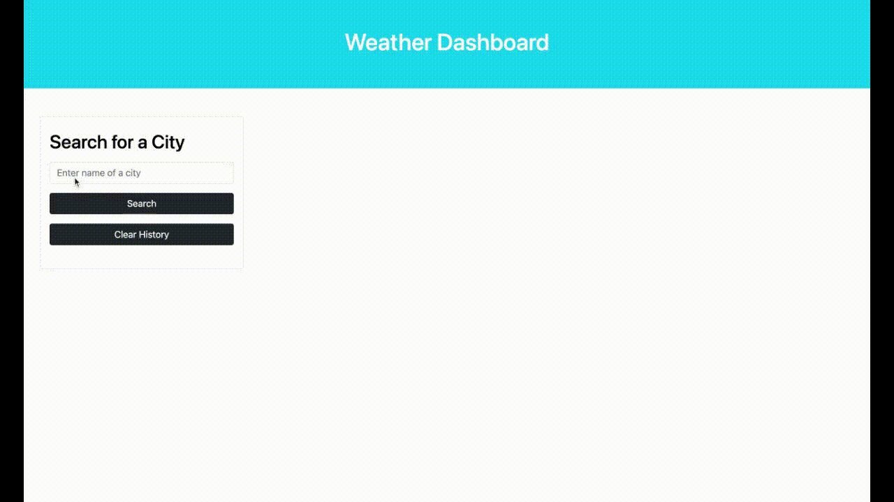

# 5-day-weather-forecast

Use this webpage to access the current and 5-day outlook weather forecast for any location in the United States.

# Description

Input a location name in the search field then click the search button. The weather for the current day will diplay at the top of the page including temperature, wind speed, and humidity. The following 5-day weather forecast will display below in a seperate box for each day. Below the search field, the previously searched locations will be displayed. The user can click on one of these fields to view the locations weather or they can clear the search history by clicking the clear history button. 

# Screenshots

# Links

GitHub Repository - https://github.com/Meljska-Fawn/5-day-weather-forecast

Website - https://meljska-fawn.github.io/5-day-weather-forecast/

# Credits

I would like to give credit to the class TAs, my tutor, AskBCS, and stackoverflow. 